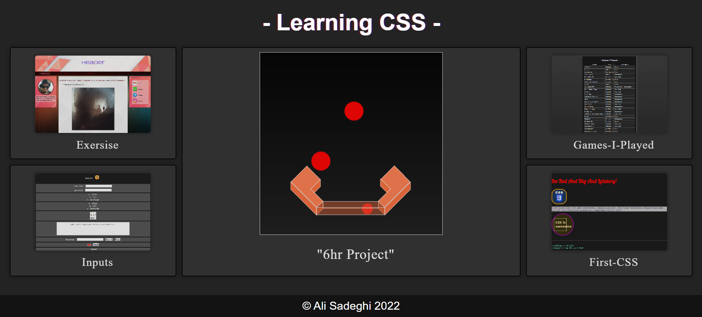

<h1>My CSS Learning Playground</h1>

    Welcome to my CSS learning playground! This is where I practice and play
    around with CSS to improve my skills. Below, I'll walk you through what
    you'll find in this repository:

<h2>Folders:</h2>
<h3>6hr-css-</h3>

    In this folder, you'll find my main CSS learning journey. It's a big CSS
    file where I've gathered around 3600 lines of code as I've learned new CSS
    techniques.

<h3>Exercise</h3>

    Here, I've built a practice website to sharpen my web development skills.
    It's where I first experimented with incorporating text-image AI.

<h3>First CSS</h3>

    This folder holds my earliest attempts at using CSS to style web pages. It's
    interesting to see how I started and how much I've progressed!

<h3>Games-I-Played</h3>

    Explore my list of games played! It's a fun project where I practice
    organizing lists. Each game comes with its status—completed, ongoing, or
    endless—and my personal opinions and rankings.

<h3>Inputs</h3>

    This is my playground for experimenting with HTML and CSS inputs. It's where
    I explore different input styles and functionalities.

<h2>Summary</h2>

    This repository is where I experiment with various CSS concepts and
    techniques. Whether I'm working on complex layouts or mastering basic
    styling, this is where it all happens.

<h2>GitHub Pages Hub</h2>

    For an interactive experience and to see my projects live, check out the
    <a
        target="_new"
        rel="noreferrer"
        href="https://ali-sdg90.github.io/Learning-CSS-/"
        >GitHub Pages Hub</a
    >. It's a showcase of my work where you can explore and interact with the
    projects firsthand.

    Feel free to clone this repository and explore the code in your favorite
    editor. Happy coding!

